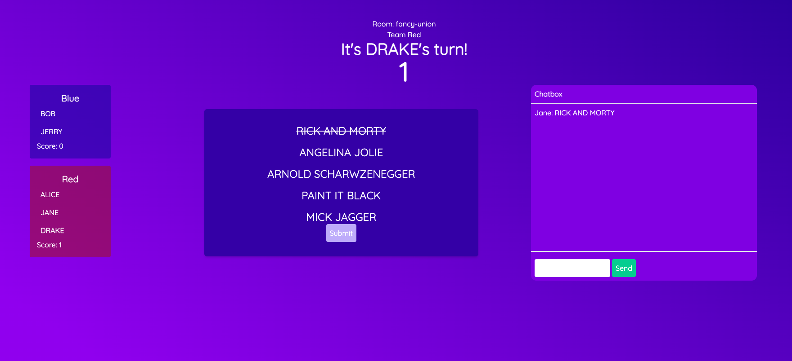

# Five words

Five words is a browser based word-guessing party game based on the popular board game 30 Seconds. 

The goal of the game is to team up and battle your friends by guessing as many words from 
a card as possible in a 30-second time limit. 

See the app in action at [heroku](https://five-words-web.herokuapp.com) - (while it is still free)

The game is created using the following:

Backend:
* Go 1.19
* Redis
* Websockets

Frontend:
* React Typescript 
* Redux
* Next.js
* Tailwindcss

## Requirements

* Docker
* Go 1.19
* Node 
* Make (if not installed, check `Makefile` for the commands)

## Running the game locally

1. Run `make up` or `docker compose up -d` 
2. The game should be available at `localhost:3000`

## Dev setup

1. Spin up the containers: `make dev.start`
2. Boot up the backend: `make server`
3. Boot up the frontend: `make web`
